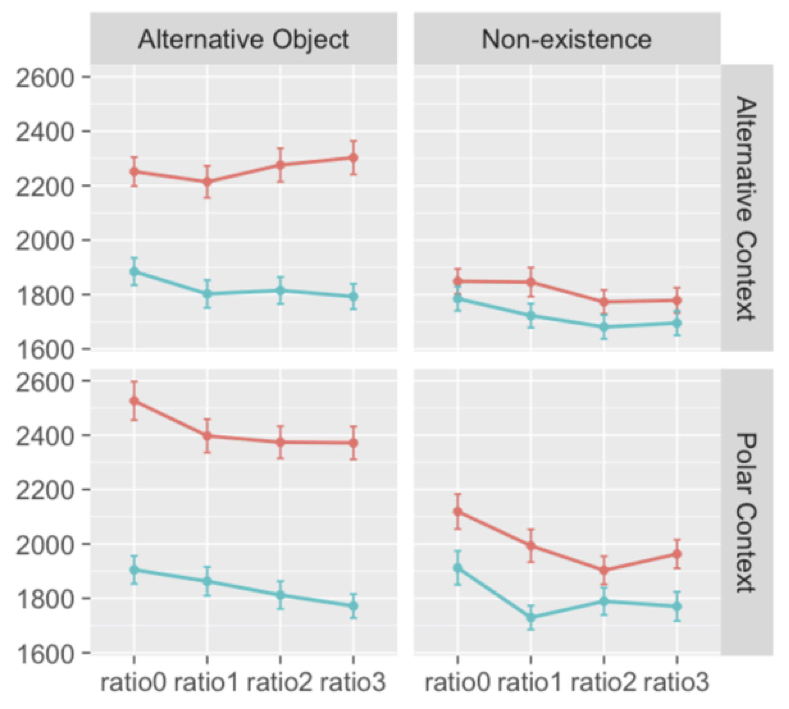
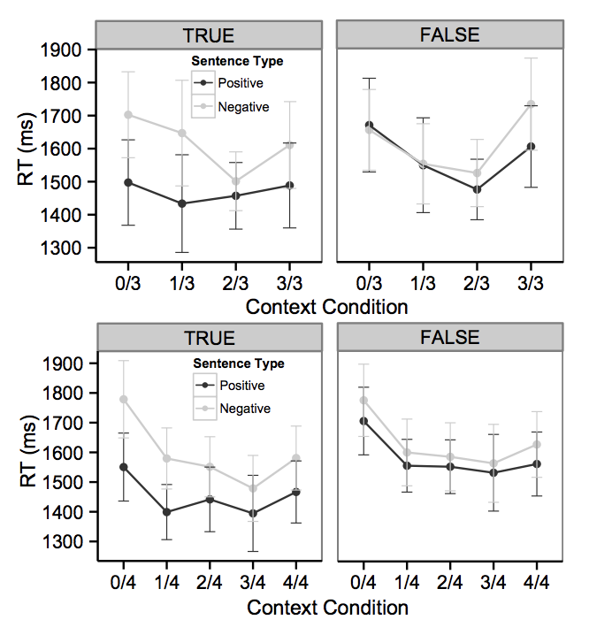

```{r setup, include=FALSE}
library(rwebppl)
library(tidyverse)
theme_set(theme_bw() + 
            theme(strip.background = element_blank(), 
                  panel.grid = element_blank())) # nice theme with limited extras
```


Make input data. 

```{r}
# speaker(allReferents.nonexistence, allContexts.nonexistence[0], "apples?").score("no apples")
df <- as_tibble(expand.grid(referent = c("alternative", "nonexistence"),
                            context = c("alternative", "nonexistence"), 
                            n_with_apples = 0:3,
                            # QUD = c("apples?", "which fruit?"), 
                            utterance = c("apples", "no apples"),
                            alpha = c(1,3,5,7,9),
                            cost = c(1,3,5,7,9),
                            consider_referent = c(T, F)))
wp.rs <- webppl(data = df, 
                  data_var = "df",
                  program_file = "model.wppl.js")

wp.rs <- wp.rs %>%
  mutate(surprisal = -log(uttProb),
          context = paste("context_", context, sep = ""),
         referent = paste("referent_", referent, sep = ""))

```

Replicate previous plot. 

```{r}
# filter(df, 
#        (context == "alternative" & QUD == "which fruit?") |
#          (context == "nonexistence" & QUD == "apples?")

ggplot(
  filter(wp.rs, alpha == 1, cost == 1, consider_referent == F), 
       aes(x = n_with_apples, y = surprisal, col = utterance)) + 
  facet_grid(context ~ referent) + 
  geom_line() + 
  ggthemes::scale_color_solarized()
```

```{r}

```
```{r}

```


### Understand QUD inference 

```{r}
# speaker(allReferents.nonexistence, allContexts.nonexistence[0], "apples?").score("no apples")
df.qud <- as_tibble(expand.grid(referent = c("alternative", "nonexistence"),
                            context = c("alternative", "nonexistence"), 
                            n_with_apples = 0:3,
                            cost = c(1),#c(1,3,5,7,9),
                            with_shirt_utts = c(T, F),
                            consider_referent = c(T, F)
                            ))
qud.rs <- webppl(data = df.qud, 
                  data_var = "df",
                  program_file = "qud.model.wppl.js")

qud.rs.tidy <- qud.rs %>%
  gather(qud, val, -with_shirt_utts, -referent, -context, -n_with_apples, -cost, -consider_referent)

ggplot(qud.rs.tidy %>%
         filter(with_shirt_utts, consider_referent), aes( x = n_with_apples, fill = qud, y = val))+
  geom_col(position = position_dodge(), color = 'black')+
  facet_grid(context~referent, scales = 'free')
```
Observations

- which referent? is always most informative (because there are 4 possibilities)
- which fruit? is usally more informative than apples?, except when the context+referent only yields 2 unique types 

- only in alternative+nonexistence or nonexistence+alternative could you get people with apples, oranges, and nothing
-apples? and which fruit? functionally the same when you only have 2 of the 3 kinds of people

#### removing the shirt utterances
```{r}
ggplot(qud.rs.tidy %>%
         filter(!with_shirt_utts), aes( x = n_with_apples, fill = qud, y = val))+
  geom_col(position = position_dodge(), color = 'black')+
  facet_grid(context~referent, scales = 'free')
```


### which referent ? - apples? quds

```{r}
 qud.rs %>%
  filter(with_shirt_utts, consider_referent) %>%
  mutate(apples_minus_ref = `apples?` - `which referent?`,
         apples_minus_fruit = `apples?` - `which fruit?`,
         context = paste("context_", context, sep = ""),
         referent = paste("referent_", referent, sep = "")
         ) %>%
  gather(qud, val, apples_minus_ref, apples_minus_fruit) %>%
  ggplot(., aes( x = n_with_apples, y = val, fill = qud))+
  geom_col(position = position_dodge(), color = 'black')+
  facet_grid(context~referent)

```


```{r}
 qud.rs %>%
  filter(with_shirt_utts, !consider_referent) %>%
  mutate(apples_minus_ref = `apples?` - `which referent?`,
         apples_minus_fruit = `apples?` - `which fruit?`,
         context = paste("context_", context, sep = ""),
         referent = paste("referent_", referent, sep = "")
         ) %>%
  gather(qud, val, apples_minus_ref, apples_minus_fruit) %>%
  ggplot(., aes( x = n_with_apples, y = val, fill = qud))+
  geom_col(position = position_dodge(), color = 'black')+
  facet_grid(context~referent)

```