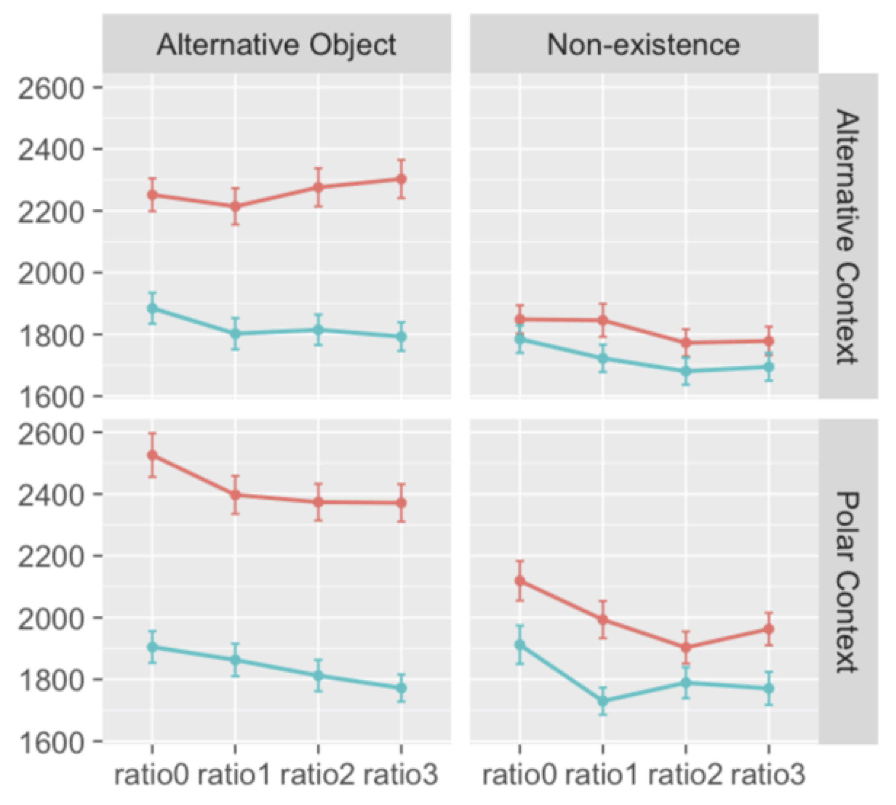
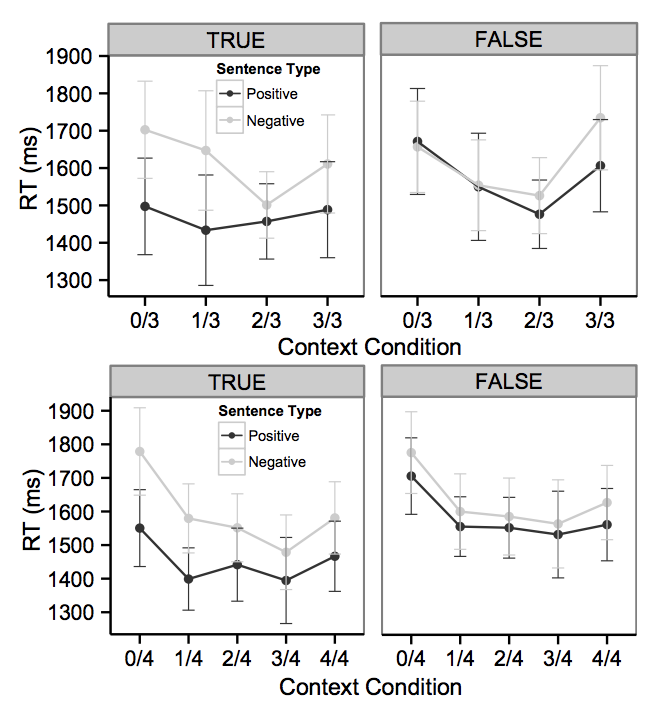

```{r setup, include=FALSE}
library(rwebppl)
library(tidyverse)
theme_set(theme_bw() + 
            theme(strip.background = element_blank(), 
                  panel.grid = element_blank())) # nice theme with limited extras
```


Make input data. 

```{r}
# speaker(allReferents.nonexistence, allContexts.nonexistence[0], "apples?").score("no apples")
df <- as_tibble(expand.grid(referent = c("alternative", "nonexistence"),
                            context = c("alternative", "nonexistence"), 
                            n_with_apples = 0:3,
                            QUD = c("apples?", "which fruit?"), 
                            utterance = c("apples", "no apples"),
                            alpha = c(1,3,5,7,9),
                            cost = c(1,3,5,7,9)))
```
 

```{r}
df$prob <- webppl(data = df, 
                  data_var = "df",
                  program_file = "model.wppl.js")
df$surprisal <- -log(df$prob)

df$referent <- factor(df$referent, levels = c("alternative", "nonexistence"), labels = c("alternative referent", "nonexistence referent"))
df$context <- factor(df$context, levels = c("alternative", "nonexistence"), labels = c("alternative context", "nonexistence context"))
```

Experimental data: 
```{r}

```
```{r}

```

Model predictions:

```{r}
#QUD = "Which fruit?"
ggplot(filter(df, alpha == 1, cost == 1, QUD == "which fruit?"), 
       aes(x = n_with_apples, y = surprisal, col = utterance)) + 
  facet_grid(context ~ referent) + 
  geom_line() + 
  ggthemes::scale_color_solarized()

#QUD = "apples?"
ggplot(filter(df, alpha == 1, cost == 1, QUD == "apples?"), 
       aes(x = n_with_apples, y = surprisal, col = utterance)) + 
  facet_grid(context ~ referent) + 
  geom_line() + 
  ggthemes::scale_color_solarized()


#QUD= "apples" for nonexistence context and QUD = "which fruit" for alternative context (Ming's prediction): 
ggplot(filter(df, alpha == 1, cost == 1, 
              (context == "alternative context" & QUD == "which fruit?") |
                (context == "nonexistence context" & QUD == "apples?")), 
       aes(x = n_with_apples, y = surprisal, col = utterance)) + 
  facet_grid(context ~ referent) + 
  geom_line() + 
  ggthemes::scale_color_solarized()

```


